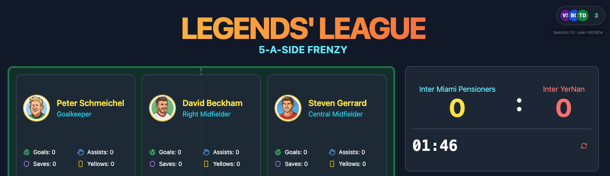

# Live AI Sports Commentary Demo

Experience the future of sports broadcasting where AI-powered insights meet realtime delivery at scale. This demo showcases how modern realtime infrastructure like [Ably](https://ably.com) can transform static data into dynamic, engaging fan experiences.

## 🚀 Why This Matters

[The Premier League recently unlocked 30 years of match data](https://aimagazine.com/news/how-microsoft-is-powering-the-premier-league-with-ai). Microsoft and Copilot can now tell fans anything about players, clubs, or matches. But unless that information arrives **in the moment** - on mobile, on broadcast, in chat, at scale - it's just trivia.

This demo shows what's possible when you combine:
- **Rich historical data** (player stats, performance history)
- **Low-latency AI processing** (OpenAI with streaming responses)
- **Realtime delivery at scale** ([Ably's global edge network][https://ably.com/network])

The result? AI commentators that react to live events within seconds, delivering contextual insights that reference player histories, team dynamics, and match statistics - all while showing the "thinking" process in realtime.

## 🎯 What This Demo Shows

Built in just a few hours, this proof of concept demonstrates:

- **Sub-second event propagation** - Match events trigger AI commentary instantly
- **Streaming AI responses** - See commentators "think" in realtime with live cursors
- **Stateful conversations** - Commentary builds on previous events for natural flow
- **Data-driven insights** - Every comment references actual player stats and history
- **Scalable architecture** - Ready to handle millions of concurrent fans
- **State synchronization** - Join mid-game and get the full context instantly

## 🏗️ How It Works

### The Stack

- **Frontend**: React + TypeScript with Ably's realtime SDKs
- **Backend**: Node.js server managing game state and AI orchestration
- **AI**: OpenAI GPT-4 with custom prompts and streaming responses
- **Realtime**: Ably for pub/sub messaging, presence, and state sync
- **Data**: Pre-loaded player statistics and match history

### Key Features

1. **Live Game Simulation**
   - Interactive 5-a-side football match
   - Click to trigger events (goals, fouls, assists)
   - Server-managed game timer and state

2. **AI Commentary Pipeline**
   - Events are batched intelligently (4-second window)
   - OpenAI processes events with full game context
   - Responses stream token-by-token to clients
   - Commentary maintains conversation history

3. **Realtime Architecture**
   - Game state on `football-frenzy:main` channel
   - Commentary on `football-frenzy:commentary` channel
   - Automatic history replay on page refresh
   - Presence tracking for connected fans

## 🎨 The Experience

Watch as Barry Banter and Ronnie Roast, our AI commentators, bring the game to life:

- **Barry** provides play-by-play with statistical insights
- **Ronnie** adds color commentary with personality
- Both reference actual player data in their commentary
- See them "think" with animated cursors before speaking

## 💡 Why Ably?

This demo leverages Ably's unique capabilities:

- **Global Edge Network**: 635+ PoPs ensuring <65ms latency worldwide
- **Guaranteed Ordering**: Commentary chunks arrive in sequence
- **History API**: New viewers get full game context instantly
- **Scalability**: From 10 to 10M fans without infrastructure changes
- **Reliability**: 99.999% uptime SLA with automatic failover

## Prerequisites

- Node.js 18+ installed
- An [Ably account](https://ably.com) with an API key
- An [OpenAI account](https://platform.openai.com) with an API key

## 😦 Getting Started

### 1. Clone the repository

```bash
git clone https://github.com/ably-labs/football-data-live-ai-commentary.git
cd football-data-live-ai-commentary
```

### 2. Install dependencies

```bash
npm install
# or
yarn install
# or
pnpm install
```

### 3. Set up environment variables

Copy the example environment file to create your local configuration:

```bash
cp .env.example .env.local
```

Edit `.env.local` and add your API keys:

```env
# Ably API Key for real-time communication
ABLY_API_KEY=your-ably-api-key

# OpenAI API Key for AI commentary generation
OPEN_AI_API_KEY=your-openai-api-key
```

**Important**: Next.js only loads environment variables from `.env.local` (not `.env`). The `.env.local` file is already in `.gitignore` and should never be committed to version control.

### 4. Run the development server

```bash
npm run dev
# or
yarn dev
# or
pnpm dev
```

Open [http://localhost:3000](http://localhost:3000) with your browser to see the result.

## 📊 Sample Data

The AI commentators reference real player statistics loaded from [`server/data/players/`](server/data/players/). Each player has:
- Career statistics (goals, assists, cards)
- Playing style descriptions
- Notable achievements
- Personality traits for commentary flavor

Example player data files:
- [Cristiano Ronaldo](server/data/cristiano_ronaldo.md)
- [David Beckham](server/data/david_beckham.md)
- [Steven Gerrard](server/data/steven_gerrard.md)
- [Thierry Henry](server/data/thierry_henry.md)
- [Peter Schmeichel](server/data/peter_schmeichel.md)

## 🧠 AI Prompts

The commentary system uses carefully crafted prompts to create engaging, contextual commentary. View the [commentary system prompt](prompts/commentary-system.md) to see how we:
- Maintain commentator personalities
- Reference player statistics naturally
- React appropriately to different events
- Keep commentary concise for realtime delivery

## 🏛️ Architecture

```
┌─────────────┐     ┌─────────────┐     ┌─────────────┐
│   Browser   │────▶│    Ably     │────▶│   Server    │
│  (React)    │◀────│   Channels  │◀────│  (Node.js)  │
└─────────────┘     └─────────────┘     └─────────────┘
                           │                     │
                           │                     ▼
                           │              ┌─────────────┐
                           │              │   OpenAI    │
                           │              │ (Streaming) │
                           │              └─────────────┘
                           ▼
                    ┌─────────────┐
                    │  History &  │
                    │    State    │
                    └─────────────┘
```

## 🚀 Taking This Further

This demo is just the beginning. With Ably's platform, you could:

- **Scale to millions**: Handle World Cup-level traffic
- **Add more AI features**: Predictions, player comparisons, tactical analysis
- **Integrate with broadcasts**: Sync commentary with live video
- **Personalize experiences**: Team-specific commentary, language preferences
- **Build interactive features**: Polls, predictions, shared reactions

## 📚 Technical Documentation

For deeper implementation details, see:
- [Architecture Overview](docs/architecture.md)

## Troubleshooting

### "OPEN_AI_API_KEY not configured" error
- Ensure you've copied `.env.example` to `.env.local`
- Verify your OpenAI API key is correctly set in `.env.local`
- Restart the development server after changing environment variables

### Ably authentication errors
- Check that your Ably API key is correctly set in `.env.local`
- Ensure the key has the necessary permissions for publishing and subscribing

## 🤝 About Ably

[Ably](https://ably.com) is the realtime experience infrastructure of the internet, used by developers to add live features to their apps. With 5+ years of 99.999% uptime and a global edge network, Ably delivers billions of messages to millions of users every day.

Learn more about:
- [Ably Pub/Sub](https://ably.com/pub-sub) - The foundation for realtime messaging
- [Ably Chat](https://ably.com/chat) - Add live commentary and fan chat
- [Four Pillars of Dependability](https://ably.com/four-pillars-of-dependability) - How Ably ensures reliability at scale

## 📬 Get In Touch

- **Questions?** Join our [Discord community](https://discord.gg/ably)
- **Found a bug?** [Open an issue](https://github.com/ably-labs/football-data-live-ai-commentary/issues)
- **Want to build something similar?** [Talk to our team](https://ably.com/contact)

---

*Built with ❤️ by the Ably team to showcase the art of the possible in realtime AI experiences.*